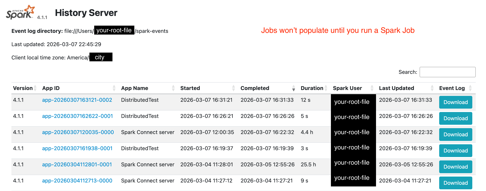

# Enabling Spark Event Logging

Spark event logging allows Spark to record detailed information about every job that runs on the cluster. This includes information about stages, tasks, executors, and runtime performance. These logs can later be viewed through the **Spark History Server**, which lets you inspect jobs even after they have finished.

In a distributed cluster this is very useful for:

- Understanding how tasks were distributed across workers
- Debugging failed jobs
- Analyzing performance and execution time
- Reviewing jobs after the Spark UI disappears

The following steps enable event logging and start the **Spark History Server** so completed jobs can be viewed later.

This configuration only needs to be performed on the **master node**.

## Step 1: Create a Directory Seperate from Spark

```bash
mkdir -p ~/spark-events
```

## Step 2: Write the Config File

```bash
nano ~/.spark/conf/spark-defaults.conf
```

Copy and paste in the following lines, change 'your-file-path' to your root folder

```bash
spark.eventLog.enabled           true
spark.eventLog.dir               file:///Users/your-file-path/spark-events
spark.history.fs.logDirectory    file:///Users/your-file-path/spark-events
```

Save and exit the file:

Ctrl + O → Enter
Ctrl + X

## Step 3: Start the Server

```bash
./sbin/start-history-server.sh
```

Visit:

[http://master-device-name:18080]

\* replace 'master-device-name' with your tailscale MagicDNS that you use to start the Spark Cluster \*

What a successful event logging UI will look similar to:


---

## Note

- The History Server runs independently from the Spark master and workers. It can remain running even when the Spark cluster is stopped.You can stop it manually using:

```bash
./sbin/stop-history-server.sh
```
