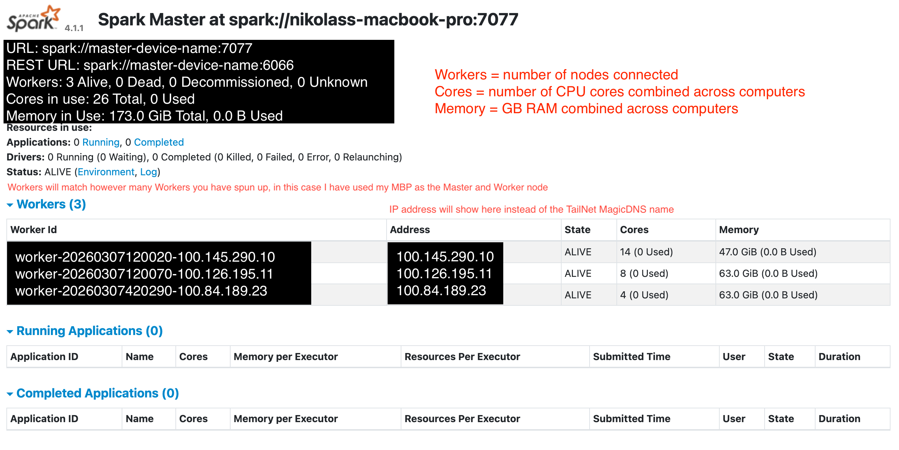

# Setting up a Spark Cluster with TailScale Using MagicDNS

## Getting Started with Tailscale

### Setting up Account

- create an account at: [https://login.tailscale.com/start]

### Installing Tailscale

- Download the Tailscale App (GUI): [https://tailscale.com/download]
- Download the Command Line Interface (CLI):

```bash
brew install tailscale
sudo tailscale up
```

- this must be done on each device to be used in the cluster

\* if you don't have homebrew, follow the instructions on this website [https://mac.install.guide/homebrew/3]

### Setting up MagicDNS

[https://login.tailscale.com/admin/dns]

- turn on MagicDNS, save configuration
- once enabled, every device in the tailnet will automatically receive a hostname
- to verify MagicDNS is working correctly, run this command in your terminal:

```bash
tailscale status
```

- you should see the MagicDNS name for each device you installed and setup tailscale on

---

## Installing Necessary Software Stack

For EACH DEVICE in the cluster, the following steps will need to be followed on ALL DEVICES. All devices must be using the same versions of Java and Spark, Python needs to be at least 4.10. Due to the age of the iMac and MacPro, older versions of the softwares are being installed.

---

### OpenJDK 21

```bash
curl -L -o OpenJDK21.pkg \ https://github.com/adoptium/temurin21-binaries/releases/download/jdk-21.0.2+13/OpenJDK21U-jdk_x64_mac_hotspot_21.0.2_13.pkg
```

```bash
sudo installer -pkg OpenJDK21.pkg -target /
```

```bash
echo 'export JAVA_HOME=$(/usr/libexec/java_home -v 21)' >> ~/.zshrc
echo 'export PATH="$JAVA_HOME/bin:$PATH"' >> ~/.zshrc
source ~/.zshrc
```

---

### Spark 4.1.1

```bash
curl -L -o spark-4.1.1.tgz \
https://downloads.apache.org/spark/spark-4.1.1/spark-4.1.1-bin-hadoop3.tgz
```

```bash
tar -xzf spark-4.1.1.tgz
mv spark-4.1.1-bin-hadoop3 ~/spark
```

---

### Installing MINIConda to Enforce Python Versions

```bash
curl -O https://repo.anaconda.com/miniconda/Miniconda3-latest-MacOSX-x86_64.sh
```

```bash
bash Miniconda3-latest-MacOSX-x86_64.sh
```

some prompts will pop up:

- hit enter
- yes
- accept the defaults

```bash
conda create -n spark310 python=3.10 pyspark -y
```

```bash
conda activate spark310
```

---

## Testing the Cluster

Step 1. Activate Conda

```bash
conda activate spark310
```

- do this on each device

Step 2. Find the Tailscale MagicDNS Names for Each Node

```bash
tailscale status
```

- remember the MagicDNS names for each device you want to be a node

Step 3. Start the Master Node

- run this command from the device to be the Master Node

```bash
$SPARK_HOME/sbin/start-master.sh \
--host master-device-name
```

\* change 'master-device-name' to your MagicDNS name from step 2 that you want to be the Master Node \*

Step 4. Start the Worker Nodes

- run this command from each of the devices to be the Worker Nodes

```bash
$SPARK_HOME/sbin/start-worker.sh \
spark://device-name:7077
```

\* change 'device-name' to your MagicDNS name from step 2 that will make up each Worker Node \*

Step 5. Verify the UI Works in a Browser

- when you copy the command into a browser node you should see an image similar to this one 

[http://master-device-name:8080]

\* change 'master-device-name' to your Master Node's MagicDNS name \*

Step 6. Use the
